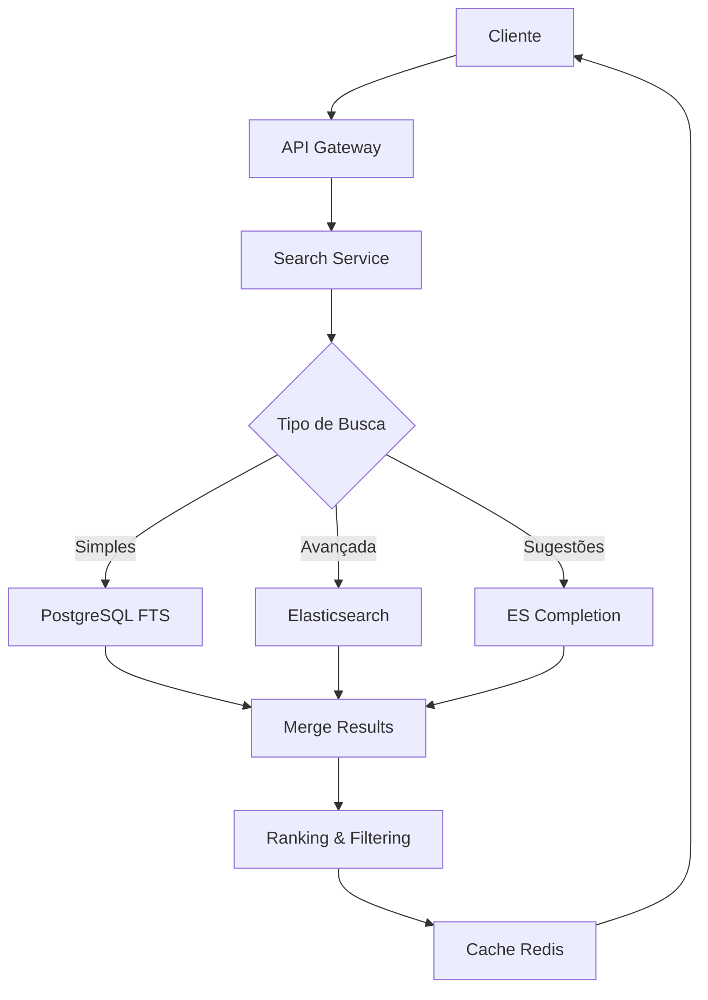

# 🔍 Estratégia de Busca Contextual

## 📋 Visão Geral

O sistema de busca do LegislaSaaS combina PostgreSQL Full Text Search com Elasticsearch para oferecer uma experiência de busca contextual avançada, relevante e performática.

## 🎯 Objetivos da Busca

### Requisitos Funcionais
1. **Busca por conteúdo**: Texto completo de leis e normas
2. **Filtros contextuais**: Categoria, tema, subtema, autor, ano
3. **Busca semântica**: Compreensão de sinônimos e contexto
4. **Auto-complete**: Sugestões em tempo real
5. **Relevância**: Ranking inteligente de resultados
6. **Performance**: Resposta sub-segundo

### Requisitos Não Funcionais
- **Escalabilidade**: Milhões de documentos
- **Disponibilidade**: 99.9% uptime
- **Precisão**: >90% de relevância
- **Recall**: >95% de cobertura

## 🏗️ Arquitetura de Busca

### Arquitetura Híbrida



### Divisão de Responsabilidades

#### PostgreSQL Full Text Search
**Use cases:**
- Busca simples por palavras-chave
- Consultas estruturadas (filtros)
- Queries complexas com JOINs
- Garantia de consistência ACID

#### Elasticsearch
**Use cases:**
- Busca semântica avançada
- Análise de texto complexa
- Agregações e facetas
- Sugestões e auto-complete
- Análise de relevância

## 📝 Modelagem de Dados

### Estrutura PostgreSQL

```sql
-- Vetor de busca gerado automaticamente
ALTER TABLE legislation_documents 
ADD COLUMN search_vector tsvector 
GENERATED ALWAYS AS (
  to_tsvector('portuguese', 
    coalesce(title, '') || ' ' || 
    coalesce(summary, '') || ' ' || 
    coalesce(full_text, '') || ' ' ||
    coalesce(author, '') || ' ' ||
    array_to_string(coalesce(keywords, '{}'), ' ')
  )
) STORED;

-- Índice GIN para performance
CREATE INDEX idx_legislation_search 
ON legislation_documents 
USING gin(search_vector);

-- Função de busca customizada
CREATE OR REPLACE FUNCTION search_legislation(
  query_text text,
  filters jsonb DEFAULT '{}'::jsonb
)
RETURNS TABLE (
  id uuid,
  title varchar,
  rank real,
  headline text
) AS $$
BEGIN
  RETURN QUERY
  SELECT 
    ld.id,
    ld.title,
    ts_rank(ld.search_vector, plainto_tsquery('portuguese', query_text)) as rank,
    ts_headline('portuguese', ld.full_text, plainto_tsquery('portuguese', query_text)) as headline
  FROM legislation_documents ld
  WHERE 
    ld.search_vector @@ plainto_tsquery('portuguese', query_text)
    AND (filters->>'type' IS NULL OR ld.type = (filters->>'type')::legislation_type)
    AND (filters->>'year' IS NULL OR ld.year = (filters->>'year')::integer)
    AND ld.status = 'active'
  ORDER BY rank DESC, ld.published_at DESC;
END;
$$ LANGUAGE plpgsql;
```

### Estrutura Elasticsearch

```json
{
  "settings": {
    "number_of_shards": 3,
    "number_of_replicas": 1,
    "analysis": {
      "analyzer": {
        "portuguese_analyzer": {
          "type": "custom",
          "tokenizer": "standard",
          "filter": [
            "lowercase",
            "portuguese_stop",
            "portuguese_stemmer",
            "asciifolding"
          ]
        },
        "search_analyzer": {
          "type": "custom",
          "tokenizer": "standard",
          "filter": [
            "lowercase",
            "portuguese_stop",
            "portuguese_light_stemmer",
            "asciifolding"
          ]
        }
      },
      "filter": {
        "portuguese_stop": {
          "type": "stop",
          "stopwords": "_portuguese_"
        },
        "portuguese_stemmer": {
          "type": "stemmer",
          "language": "light_portuguese"
        },
        "portuguese_light_stemmer": {
          "type": "stemmer",
          "language": "minimal_portuguese"
        }
      }
    }
  },
  "mappings": {
    "properties": {
      "id": { "type": "keyword" },
      "title": {
        "type": "text",
        "analyzer": "portuguese_analyzer",
        "search_analyzer": "search_analyzer",
        "fields": {
          "keyword": { "type": "keyword" },
          "suggest": {
            "type": "completion",
            "analyzer": "simple",
            "search_analyzer": "simple"
          }
        }
      },
      "summary": {
        "type": "text",
        "analyzer": "portuguese_analyzer",
        "search_analyzer": "search_analyzer"
      },
      "fullText": {
        "type": "text",
        "analyzer": "portuguese_analyzer",
        "search_analyzer": "search_analyzer"
      },
      "categories": {
        "type": "nested",
        "properties": {
          "id": { "type": "keyword" },
          "name": {
            "type": "text",
            "analyzer": "portuguese_analyzer",
            "fields": {
              "keyword": { "type": "keyword" }
            }
          }
        }
      },
      "themes": {
        "type": "keyword"
      },
      "subthemes": {
        "type": "keyword"
      },
      "author": {
        "type": "text",
        "analyzer": "portuguese_analyzer",
        "fields": {
          "keyword": { "type": "keyword" }
        }
      },
      "type": { "type": "keyword" },
      "year": { "type": "integer" },
      "publishedAt": { "type": "date" },
      "keywords": { "type": "keyword" },
      "status": { "type": "keyword" }
    }
  }
}
```

## 🔄 Sincronização de Dados

### Estratégia de Indexação

#### Real-time Sync
```typescript
@Injectable()
export class DocumentSyncService {
  
  @OnEvent('legislation.created')
  async handleDocumentCreated(event: DocumentCreatedEvent) {
    try {
      // Index em Elasticsearch
      await this.elasticsearchService.index({
        index: 'legislation',
        id: event.document.id,
        body: this.transformToESDocument(event.document)
      });
      
      // Log da operação
      this.logger.log(`Document ${event.document.id} indexed successfully`);
    } catch (error) {
      // Fallback para reindexação posterior
      await this.queueReindexing(event.document.id);
      this.logger.error(`Failed to index document ${event.document.id}`, error);
    }
  }

  @OnEvent('legislation.updated')
  async handleDocumentUpdated(event: DocumentUpdatedEvent) {
    await this.elasticsearchService.update({
      index: 'legislation',
      id: event.document.id,
      body: {
        doc: this.transformToESDocument(event.document),
        doc_as_upsert: true
      }
    });
  }

  @OnEvent('legislation.deleted')
  async handleDocumentDeleted(event: DocumentDeletedEvent) {
    await this.elasticsearchService.delete({
      index: 'legislation',
      id: event.documentId
    });
  }
}
```

#### Bulk Reindexing
```typescript
@Injectable()
export class ReindexingService {
  
  async reindexAll(): Promise<void> {
    const batchSize = 1000;
    let offset = 0;
    
    while (true) {
      const documents = await this.documentRepository.findMany({
        skip: offset,
        take: batchSize,
        include: {
          categories: true,
          themes: true,
          subthemes: true
        }
      });
      
      if (documents.length === 0) break;
      
      // Bulk index
      const body = documents.flatMap(doc => [
        { index: { _index: 'legislation', _id: doc.id } },
        this.transformToESDocument(doc)
      ]);
      
      await this.elasticsearchService.bulk({ body });
      
      offset += batchSize;
      this.logger.log(`Indexed ${offset} documents`);
    }
  }
}
```

## 🎯 Algoritmos de Busca

### Busca Simples (PostgreSQL)

```typescript
@Injectable()
export class SimpleSearchService {
  
  async search(query: string, filters: SearchFilters): Promise<SearchResults> {
    const sql = `
      SELECT 
        id,
        title,
        summary,
        type,
        year,
        author,
        ts_rank(search_vector, plainto_tsquery('portuguese', $1)) as rank,
        ts_headline('portuguese', full_text, plainto_tsquery('portuguese', $1), 
          'MaxWords=35, MinWords=15, StartSel=<mark>, StopSel=</mark>'
        ) as highlight
      FROM legislation_documents
      WHERE 
        search_vector @@ plainto_tsquery('portuguese', $1)
        ${this.buildFilterConditions(filters)}
        AND status = 'active'
      ORDER BY rank DESC, published_at DESC
      LIMIT $2 OFFSET $3
    `;
    
    return this.database.query(sql, [query, filters.limit, filters.offset]);
  }
}
```

### Busca Avançada (Elasticsearch)

```typescript
@Injectable()
export class AdvancedSearchService {
  
  async search(query: SearchQuery): Promise<SearchResults> {
    const searchBody = {
      query: {
        bool: {
          must: [
            {
              multi_match: {
                query: query.text,
                fields: [
                  'title^3',           // Boost título
                  'summary^2',         // Boost resumo
                  'fullText',
                  'author^1.5',        // Boost autor
                  'keywords^2'         // Boost palavras-chave
                ],
                type: 'best_fields',
                fuzziness: 'AUTO',     // Tolerância a erros
                operator: 'and'
              }
            }
          ],
          filter: this.buildFilters(query.filters),
          should: [
            // Boost por recência
            {
              function_score: {
                gauss: {
                  publishedAt: {
                    origin: 'now',
                    scale: '365d',      // 1 ano
                    decay: 0.5
                  }
                }
              }
            },
            // Boost por categoria relevante
            {
              nested: {
                path: 'categories',
                query: {
                  match: {
                    'categories.name': {
                      query: query.text,
                      boost: 1.5
                    }
                  }
                }
              }
            }
          ],
          minimum_should_match: '0'
        }
      },
      highlight: {
        fields: {
          title: { fragment_size: 150, number_of_fragments: 1 },
          summary: { fragment_size: 150, number_of_fragments: 2 },
          fullText: { fragment_size: 150, number_of_fragments: 3 }
        },
        pre_tags: ['<mark>'],
        post_tags: ['</mark>']
      },
      aggregations: {
        categories: {
          nested: { path: 'categories' },
          aggs: {
            category_names: {
              terms: { field: 'categories.name.keyword', size: 20 }
            }
          }
        },
        types: {
          terms: { field: 'type', size: 10 }
        },
        years: {
          terms: { field: 'year', size: 20, order: { _key: 'desc' } }
        },
        authors: {
          terms: { field: 'author.keyword', size: 20 }
        }
      },
      sort: [
        { _score: { order: 'desc' } },
        { publishedAt: { order: 'desc' } }
      ],
      from: query.offset,
      size: query.limit
    };
    
    const response = await this.elasticsearchClient.search({
      index: 'legislation',
      body: searchBody
    });
    
    return this.transformSearchResponse(response);
  }
}
```

### Auto-complete e Sugestões

```typescript
@Injectable()
export class SuggestionService {
  
  async getSuggestions(input: string): Promise<Suggestion[]> {
    const response = await this.elasticsearchClient.search({
      index: 'legislation',
      body: {
        suggest: {
          title_suggest: {
            prefix: input,
            completion: {
              field: 'title.suggest',
              size: 10,
              skip_duplicates: true
            }
          },
          phrase_suggest: {
            text: input,
            phrase: {
              field: 'fullText',
              size: 5,
              gram_size: 3,
              direct_generator: [
                {
                  field: 'fullText',
                  suggest_mode: 'missing',
                  min_word_length: 1
                }
              ]
            }
          }
        }
      }
    });
    
    return this.transformSuggestions(response.body.suggest);
  }
  
  async getRelatedTerms(term: string): Promise<string[]> {
    // Busca por documentos similares
    const response = await this.elasticsearchClient.search({
      index: 'legislation',
      body: {
        query: {
          more_like_this: {
            fields: ['title', 'summary', 'fullText'],
            like: term,
            min_term_freq: 1,
            max_query_terms: 12
          }
        },
        aggregations: {
          keywords: {
            terms: {
              field: 'keywords',
              size: 20
            }
          }
        }
      }
    });
    
    return response.body.aggregations.keywords.buckets.map(b => b.key);
  }
}
```

## 📊 Métricas e Analytics

### Search Analytics

```typescript
@Injectable()
export class SearchAnalyticsService {
  
  async logSearch(searchEvent: SearchEvent): Promise<void> {
    // Log no banco para analytics
    await this.searchLogRepository.create({
      userId: searchEvent.userId,
      sessionId: searchEvent.sessionId,
      query: searchEvent.query,
      filters: searchEvent.filters,
      resultsCount: searchEvent.resultsCount,
      responseTime: searchEvent.responseTime,
      clickedResults: searchEvent.clickedResults,
      timestamp: new Date()
    });
    
    // Métricas em tempo real
    this.metricsService.increment('search.total');
    this.metricsService.histogram('search.response_time', searchEvent.responseTime);
    
    if (searchEvent.resultsCount === 0) {
      this.metricsService.increment('search.no_results');
    }
  }
  
  async getPopularQueries(timeframe: string): Promise<PopularQuery[]> {
    return this.searchLogRepository.query(`
      SELECT 
        query,
        COUNT(*) as frequency,
        AVG(results_count) as avg_results,
        AVG(response_time_ms) as avg_response_time
      FROM search_logs 
      WHERE created_at > NOW() - INTERVAL '${timeframe}'
      GROUP BY query
      HAVING COUNT(*) >= 5
      ORDER BY frequency DESC
      LIMIT 50
    `);
  }
}
```

### Performance Monitoring

```typescript
@Injectable()
export class SearchPerformanceService {
  
  async monitorSearchPerformance(): Promise<PerformanceMetrics> {
    const [pgMetrics, esMetrics] = await Promise.all([
      this.getPostgreSQLMetrics(),
      this.getElasticsearchMetrics()
    ]);
    
    return {
      postgresql: {
        avgQueryTime: pgMetrics.avgQueryTime,
        activeConnections: pgMetrics.activeConnections,
        cacheHitRatio: pgMetrics.cacheHitRatio
      },
      elasticsearch: {
        avgQueryTime: esMetrics.query.avg_time_in_millis,
        indexingRate: esMetrics.indexing.index_total,
        searchRate: esMetrics.search.query_total,
        clusterHealth: esMetrics.cluster.status
      }
    };
  }
}
```

## ⚡ Otimizações de Performance

### Caching Strategy

```typescript
@Injectable()
export class SearchCacheService {
  
  private readonly CACHE_TTL = 300; // 5 minutos
  
  async getCachedResults(cacheKey: string): Promise<SearchResults | null> {
    const cached = await this.redis.get(cacheKey);
    return cached ? JSON.parse(cached) : null;
  }
  
  async setCachedResults(cacheKey: string, results: SearchResults): Promise<void> {
    await this.redis.setex(cacheKey, this.CACHE_TTL, JSON.stringify(results));
  }
  
  generateCacheKey(query: SearchQuery): string {
    return `search:${crypto
      .createHash('md5')
      .update(JSON.stringify(query))
      .digest('hex')}`;
  }
}
```

### Query Optimization

```typescript
@Injectable()
export class SearchOptimizationService {
  
  async optimizeQuery(query: string): Promise<string> {
    // Remove stop words desnecessárias
    const cleanQuery = this.removeStopWords(query);
    
    // Expande abreviações comuns
    const expandedQuery = this.expandAbbreviations(cleanQuery);
    
    // Adiciona sinônimos
    const synonymQuery = await this.addSynonyms(expandedQuery);
    
    return synonymQuery;
  }
  
  private removeStopWords(query: string): string {
    const stopWords = ['o', 'a', 'de', 'da', 'do', 'em', 'na', 'no', 'para'];
    return query
      .split(' ')
      .filter(word => !stopWords.includes(word.toLowerCase()))
      .join(' ');
  }
  
  private expandAbbreviations(query: string): string {
    const abbreviations = {
      'rj': 'rio de janeiro',
      'alerj': 'assembleia legislativa estado rio janeiro',
      'pec': 'proposta emenda constitucional'
    };
    
    let expandedQuery = query;
    Object.entries(abbreviations).forEach(([abbr, expansion]) => {
      const regex = new RegExp(`\\b${abbr}\\b`, 'gi');
      expandedQuery = expandedQuery.replace(regex, expansion);
    });
    
    return expandedQuery;
  }
}
```

## 🔮 Futuras Melhorias

### Machine Learning
- **Relevance Learning**: Modelo treinado com click-through data
- **Semantic Search**: Embeddings semânticos com transformers
- **Query Understanding**: NER para entidades específicas do domínio
- **Personalization**: Busca personalizada por histórico do usuário

### Advanced Features
- **Federated Search**: Integração com outras casas legislativas
- **Voice Search**: Busca por voz com speech-to-text
- **Visual Search**: Upload de imagens de documentos
- **Temporal Search**: Busca por período específico com análise temporal